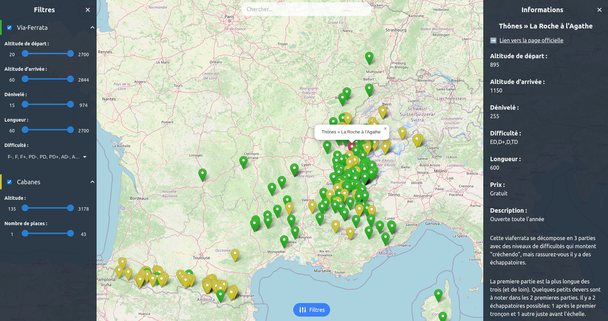

# αvisto

➡️ Check the website here : [https://kiitoss.github.io/avisto/](https://kiitoss.github.io/avisto/)

## What is αvisto ?

αvisto is a project that helps outdoor sports enthusiasts easily find exciting activities nearby.

By gathering GPS points of different sports activities and of different sources on an interactive map, users can quickly discover new areas and plan their itinerary by including multiple activities on the map.

Plus, with filters that let you show or hide certain points based on your preferences, you can customize your search and find exactly what you're looking for.

Whether you're a beginner or experienced, αvisto is the perfect tool to help you explore the outdoors and find fun activities.

## Current activities

- [x] via-ferratas ([https://www.viaferrata-fr.net/](https://www.viaferrata-fr.net/))
- [x] refuges.infos ([https://www.refuges.info/](https://www.refuges.info/))
